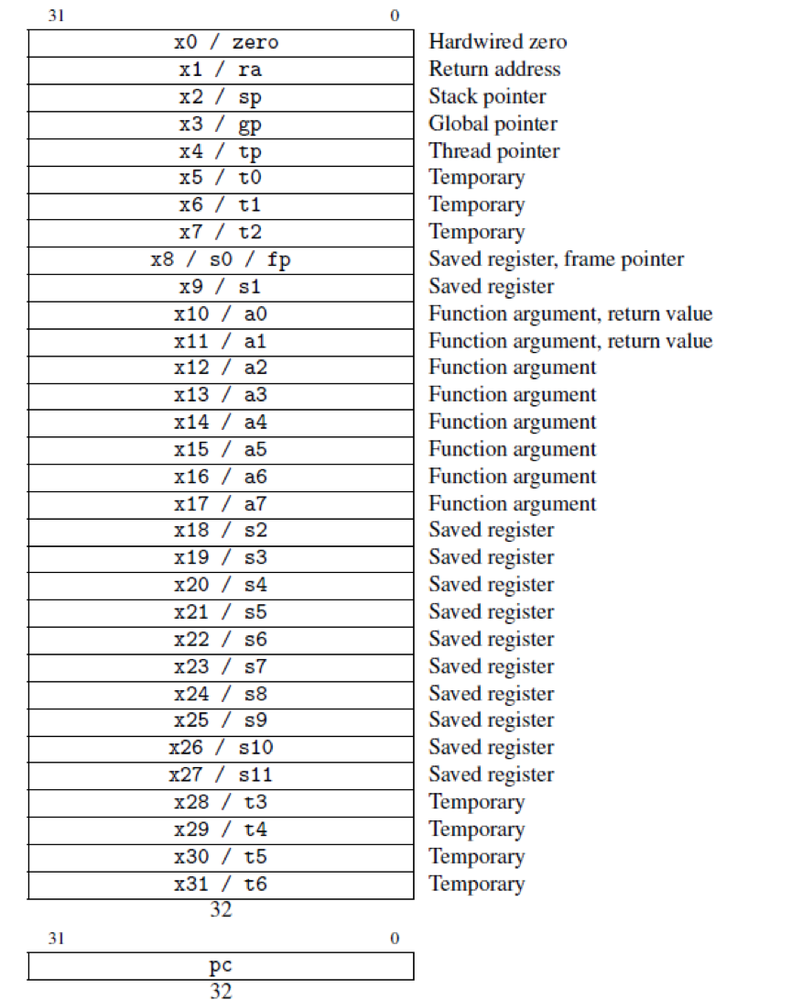

# 特性：RV32I寄存器概述

相比cisc指令，risc指令以精简高效著称。实现如此令人惊叹的结果的一大原因，便是risc的寄存器数量远远超出它的同行：光是通用寄存器，非嵌入式的riscv便具有32个，还不包括特殊寄存器以及各种可扩充模组。这些寄存器帮助riscv指令基本成为硬件层面的逻辑组合，而不是微程序的叠加，效率无疑得到极大的提升。

考虑到复杂程度，以及对本操作系统的相关程度，本节只对**32位**下的**非嵌入式通用整数**寄存器组——**RV32I**进行说明。xv6-riscv所用到的的通用寄存器在本节都会简单介绍，而分布较为零散的特殊寄存器将会在使用时于其他文档内提及。

## "0"寄存器（zero）

RV32I最奇特的地方之一就是它专门为0设置了一个寄存器，这个寄存器只可读而不可写，永远保持0的状态。**x0**寄存器专门完成这一项工作。鉴于0的使用频率并不算少，这个简单的思路可以带来效率上惊人的提升。

## 返回地址寄存器（ra）及栈指针寄存器（sp）

**x1**寄存器保存了栈数据中返回的地址，而**x2**保存了栈顶的位置。它们的作用与x86中的**ebp**和**esp**基本等同。

## 全局指针寄存器（gp）

**x3**的作用为实现4KB大小范围内的访问加速。这对页内寻址（详见“特性：页面管理 & 映射”）有着非常不错的效果，不过对主体运行原理没有什么太大影响，不感兴趣可以直接跳过。

## 线程指针寄存器（tp\)

RV32I另一个专门存储的常量便是当前硬件线程（hart，或者说CPU，与进程process不同）编号。这个量主要是方便实现各个硬件线程的区分。它的一大用处便是可以非常轻松地实现互斥，而不必用一大堆过于复杂的锁关系来判别。**x4**保存了这个量，一般来说在系统运行过程中都发生不会更改。

## 暂存寄存器（t0~t6\)

用于保存临时数。

## 存储寄存器（s0~s10）

保存必要的数据。这部分数据在**切换上下文**的时候会得到保存，而不是覆盖。

## 参数寄存器（a0~a7）

保存函数参数。调用函数时，参数将按顺序存放在这些寄存器中，相应地，使用参数的步骤会在汇编中转化为读取参数寄存器的内容。

传参过程基本上等同于x86系统，但这方面有一些细节值得密切注意：

* **a0和a1比较特殊。**它们不仅担任函数调用时的传参过程，还在返回时担任存放返回值；
* **参数并非严格按照一个参数占一个寄存器的规则排列。**64位的数据可能需要两个寄存器（这也是为什么返回寄存器不单单只有**a0**）。如果参数的总大小大于存储器所能容纳的大小，多余参数将存放在内存中，按照特定的规则调用；
* **作为参数/返回寄存器，只有写入新参数或返回值时寄存器才会被覆盖。**也就是说，若子函数的参数较少，则有可能**通过读取寄存器来间接调用父函数的参数**（这个用法后面会涉及到）；
* **a7不仅是参数寄存器，还是用来表示系统调用号。**当采取riscv的系统调用指令`ecall`后，硬件将根据**a7**内的数据，于中断向量表中启动对应编号的中断进程。

\*\*\*\*

