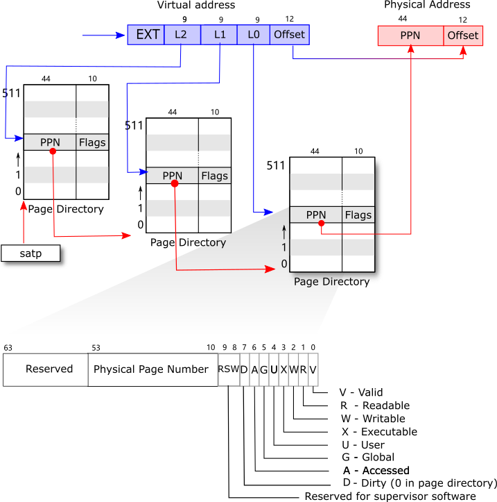
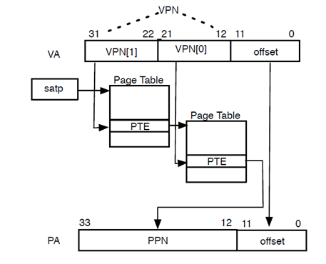

# 特性：页面管理 & 映射

riscv有很多种管理页面的手段。对于32位的机器，riscv-32一般采用**sv32**的方式管理页面；而对于64位的机器，**sv39**成为riscv-64上广受欢迎的方案。

xv6-riscv采用的即为sv39的方式：

riscv64采用64位的地址，在启动分页前为物理地址，启动后则使用虚拟地址。sv39标准下，虚拟地址只使用低39位，而高25位不予采用；64位的页表项（page table entry，PTE）仅使用低54位，高10位不予采用。这两个未采用部分都可以作为新标准可能需要的扩展空间。

分页模式的架构如下：

* **基页面**为页面的最小单位，由页表来找到相应的地址。大小一般为**4KB**；
* **页表项（page table entry，PTE）**为记载页面地址信息的数据结构，由物理页面号**（physical page number，PPN）**和标志位**（flags）**组成；
* **页表**为划分为多个等级，每一个页表拥有若干PTE，由更高级的页表来找到对应的位置。最高级别的页表不需要另外寻找位置，而是在启动分页模式时手动将它的位置存放在**satp（Supervisor Address Translation and Protection）**寄存器的高位。**页表本身也是一个基页面。**

